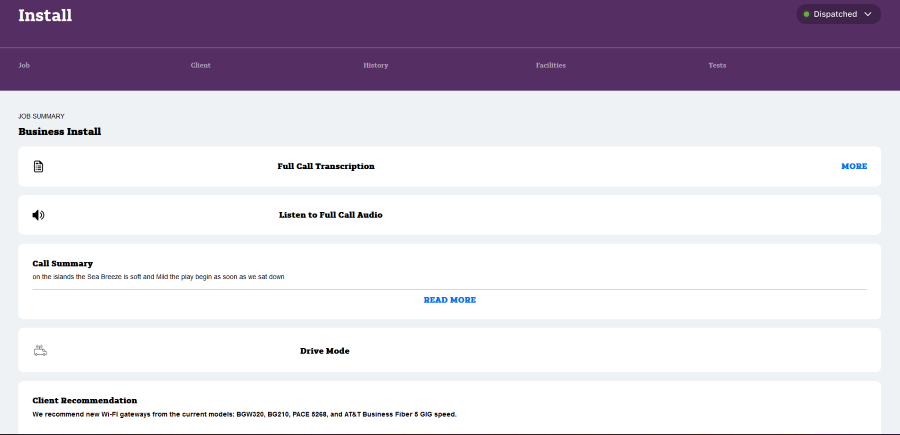
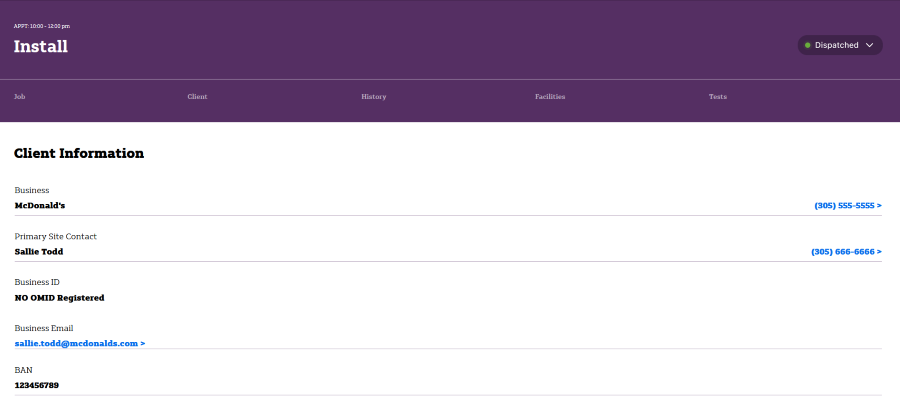
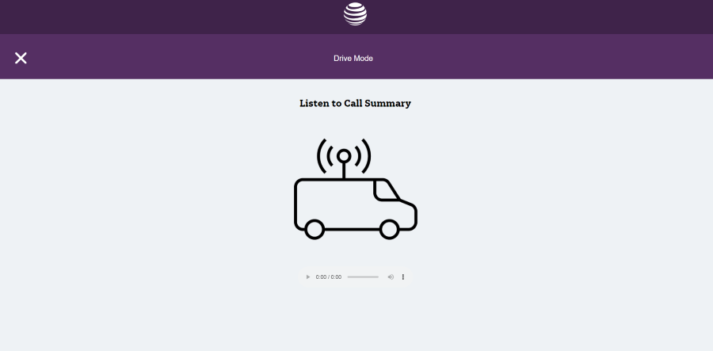
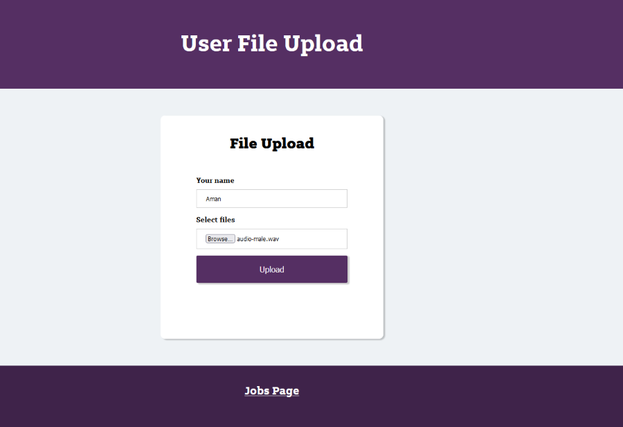

# Intern Innovation Challenge: Speech to Text Summarizer
## Virtual Vanguards
This is the draft concept design for a speech-to-text summarizer application. The application should transcribe speech to text, summarize the text, and output this summary as speech.

## Prerequisites
- You need the latest version of `Node.js` installed
- You need the latest version of `python` installed.
- You need to install the following Python modules if they aren't already:
    - `pip install warnings`
    - `pip install -U Flask`
    - `pip install pandas`
    - `pip install aiohttp`
    - `pip install torch`
    - `pip install numpy`
    - `pip install matplotlib`
    - `pip install bert-extractive-summarizer`
    - `pip install -U sentence-transformers`

- NOTE: To bypass the AT&T proxy for python module installs, use the following command: `python -m pip install --proxy sub.proxy.att.com:8080 --trusted-host files.pythonhosted.org --trusted-host pypi.org --trusted-host pypi.python.org [python-package]`

- You need to install the required external libraries through these commands: 
    - `npm install --save @google-cloud/speech`
    - `npm install --save @google-cloud/text-to-speech`

# How to Run / Usage
- Clone this repository or download the source code and open it up in your IDE.
- If you do not have all the node module dependencies satisfied, you should run in your terminal `npm ci` to install the exact dependencies in the `package-lock.json`.

## Run the FrontEnd Server
- To run the frontend server, input into the console `npm run devStart`
- This should run a local server on `localhost:3000`.

## Run The Backend Server
- To run the backend server, input into a separate console `cd backend` and then run the server with `python backend\app.py`.

## Run the entire Application
- After the frontend and backend are connected navigate to `localhost:3000/user` in your browser to load the user home page.
- Here you will want to click `Select Files` and drop down any `.wav` file.
- A sample `.wav` file is provided in the `resources` folder.
- Click `Upload`. 
- If your frontend and backend are connected properly, your transcribed text, synthesized audio, uploaded audio, and summary text should be available to view in `localhost:3000/jobs`.
- Navigate to `localhost:3000/jobs` and click on the hyperlink to view them.

# Views and Navigation
# Jobs View
- The jobs page displays the `Call Summary` which contains the text of the summarized call using a trained sentence extractor ML Model. The `Drive Mode` button links to the page containing an audio player that plays the summarized audio by using Google API's text-speech on the summarized text. The `Client Recommendation` contains the recommended solutions for the client using a multivariate linear regression ML model to predict issues given previous client data. 
### 

# Client View
- The client page displays information about the given client that plays the summarized audio by using Google API's text-to-speech on the summarized text.
### 

## Drive Mode View
- The drive mode page displays an audio player that plays the summarized text-to-speech audio. 
### 

# Upload View
- The upload page displays a `Your name` and `Select Files` option. The `Select Files` accepts a `.wav` file that will be transcribed, summarized, and analyzed for prediction data.
### 

# Flow Chart
### 

## Notes
- `training` contains training data in the form of a CSV that is used to train the MLR Model
- `get_client_data.py` spoofs random client data that will be used in the MLR. These values can be changed, as long as they fit within the ranges specified in `training-data.csv`
- `Nodemon` is in the packages folder. This way, every time you save changes, it is reflected on the server.

## Authors
- Brianna Desai
- Evan Lock
- Aman Hogan-Bailey
- An Tran
- Dhruv Agarwal
- Karina Batra

